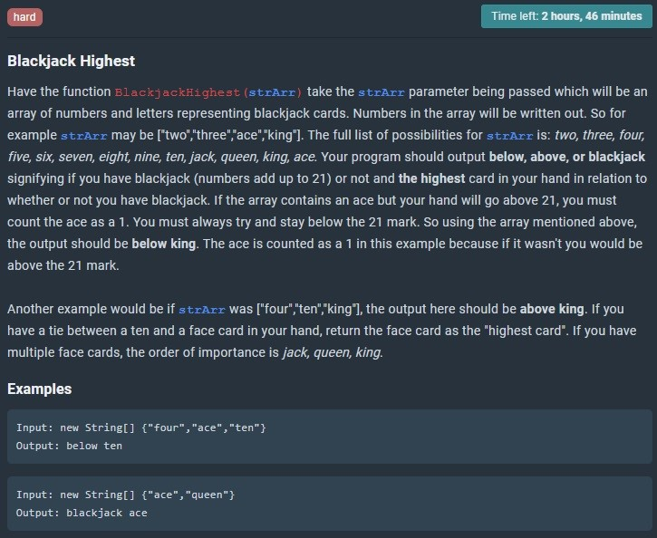

# Blackjack

Have the function BlackjackHighest(strArr) take the strArr parameter being passed which will be an array of numbers and letters representing blackjack cards. Numbers in the array will be written out. So for example strArr may be ['two","three",'ace","king"]. The full list of possibilities for strArr is: two, three, four, five, six, seven, eight, nine, ten, jack, queen, king, ace. Your program should output below, above, or blackjack signifying if you have blackjack (numbers add up to 21) or not and the highest card in your hand in relation to whether or not you have blackjack. If the array contains an ace but your hand will go above 21, you must count the ace as a 1. You must always try and stay below the 21 mark. So using the array mentioned above, the output should be below king. The ace is counted as a 1 in this example because if it wasn't you would be above the 21 mark. Another example would be if strArr was ["four","ten","king'], the output here should be above king. If you have a tie between a ten and a face card in your hand, return the face card as the "highest card'. If you have multiple face cards, the order of importance is jack, queen, king.



## Testing

Run

```sh
$ node test.js
```

to show whether the test cases are true or false. You can add new test cases into the "testCases" constant with the format of [testCase, expectedOutput].
