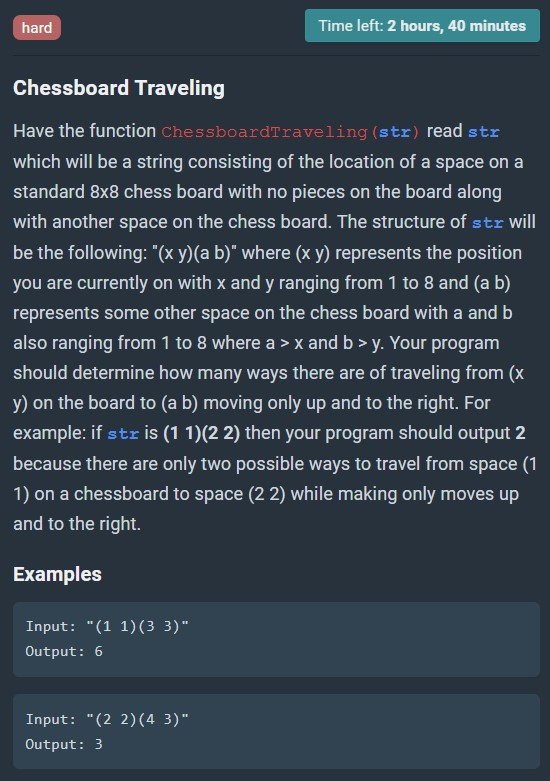

# Chessboard Traveling

Have the function ChessboardTraveling(str) read str which will be a string consisting of the location of a space on a standard 8x8 chess board with no pieces on the board along with another space on the chess board. The structure of str will be the following: "(x y)(a b)" where (x y) represents the position you are currently on with x and y ranging from 1 to 8 and (a b) represents some other space on the chess board with a and b also ranging from 1 to 8 where a > x and b > y. Your program should determine how many ways there are of traveling from (x y) on the board to (a b) moving only up and to the right. For example: if str is (1 1)(2 2) then your program should output 2 because there are only two possible ways to travel from space (1 1) on a chessboard to space (2 2) while making only moves up and to the right.

Examples  
Input: "(1 1)(3 3)"  
Output: 6  
Input: "(2 2)(4 3)"  
Output: 3



## Testing

Run

```sh
$ node test.js
```

to show whether the test cases are true or false. You can add new test cases into the "testCases" constant within the format of [testCase, expectedOutput].
