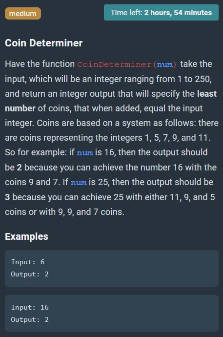

# Coin Determiner

Have the function CoinDeterminer(num) take the input, which will be an integer ranging from 1 to 250, and return an integer output that will specify the least number of coins, that when added, equal the input integer. Coins are based on a system as follows: there are coins representing the integers 1, 5, 7, 9, and 11. So for example: if num is 16, then the output should be 2 because you can achieve the number 16 with the coins 9 and 7. If num is 25, then the output should be 3 because you can achieve 25 with either 11, 9, and 5 coins or with 9, 9, and 7 coins.

Examples  
Input: 6  
Output: 2  
Input: 16  
Output: 2



## Testing

Run

```sh
$ node test.js
```

to show whether the test cases are true or false. You can add new test cases into the "testCases" constant with the format of [testCase, expectedOutput].
