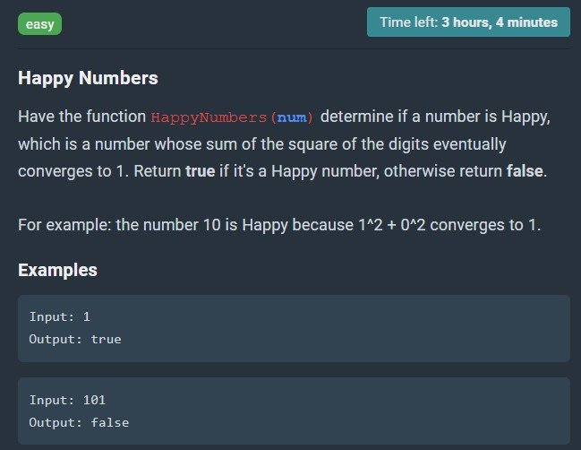

# Happy Numbers

Have the function HappyNumbers(num) determine if a number is Happy, which is a number whose sum of the square of the digits eventually converges to 1. Return true if it's a Happy number, otherwise return false.

For example: the number 10 is Happy because 1^2 + 0^2 converges to 1.  
Examples  
Input: 1  
Output: true  
Input: 101  
Output: false



## Testing

Run

```sh
$ node test.js
```

to show whether the test cases are true or false. You can add new test cases into the "testCases" constant within the format of [testCase, expectedOutput].
