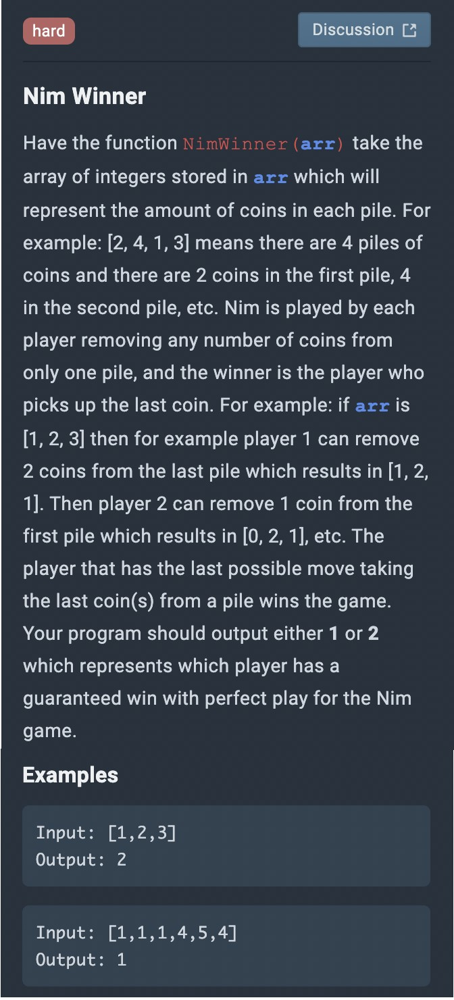

# Roman Numeral Reduction

Have the function NimWinnner(arr) take the array of integers stored in arr which will represent the amount of coins in each pile. For example: [2, 4, 1, 3] means there are 4 piles of coins and there are 2 coins in the first pile, 4 in the second pile, etc. Nim is played by each player removing any number of coins from only one pile, and the winner is the player who picks up the last coin. For example: if arr is [1, 2, 3] then for example player 1 can remove 2 coins from the last pile which results in [1, 2, 1]. Then player 2 can remove 1 coin from the first pile which results in [0,2, 1], etc. The player that has the last possible move taking the last coin(s) from a pile wins the game. Your program should output either 1 or 2 which represents which player has a guaranteed win with perfect play for the Nim game.



## Testing

Run

```sh
$ node test.js
```

to show whether the test cases are true or false. You can add new test cases into the "testCases" constant with the format of [testCase, expectedOutput].
