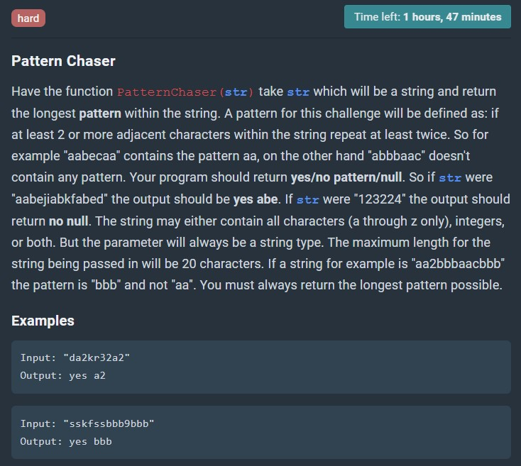

# Pattern Chaser

Have the function PatternChaser(str) take str which will be a string and return the longest pattern within the string. A pattern for this challenge will be defined as: if at least 2 or more adjacent characters within the string repeat at least twice. So for example "aabecaa" contains the pattern aa, on the other hand "abbbaac" doesn't contain any pattern. Your program should return yes/no pattern/null. So if str were "aabejiabkfabed" the output should be yes abe. If str were "123224" the output should return no null. The string may either contain all characters (a through z only), integers, or both. But the parameter will always be a string type. The maximum length for the string being passed in will be 20 characters. If a string for example is "aa2bbbaacbbb" the pattern is "bbb" and not "aa". You must always return the longest pattern possible.

Examples  
Input: "da2kr32a2"  
Output: yes a2  
Input: "sskfssbbb9bbb"  
Output: yes bbb



## Testing

Run

```sh
$ node test.js
```

to show whether the test cases are true or false. You can add new test cases into the "testCases" constant within the format of [testCase, expectedOutput].
