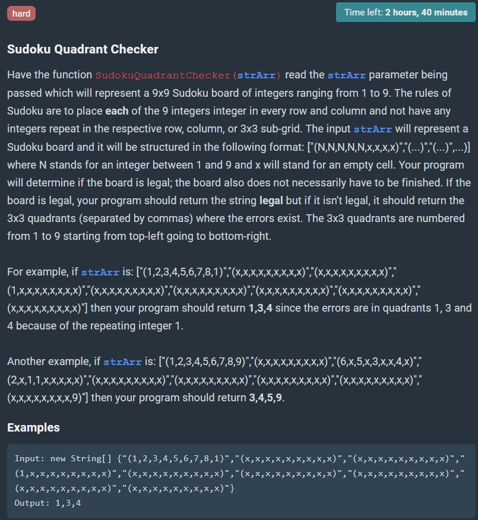

# Sudoku Quadrant Checker

Have the function SudokuQuadrantChecker(strArr) read the strArr parameter being passed which will represent a 9x9 Sudoku board of integers ranging from 1 to 9. The rules of Sudoku are to place each of the 9 integers integer in every row and column and not have any integers repeat in the respective row, column, or 3x3 sub-grid. The input strArr will represent a Sudoku board and it will be structured in the following format: ["(N,N,N,N,N,x,x,x,x)","(...)","(...)",...)] where N stands for an integer between 1 and 9 and x will stand for an empty cell. Your program will determine if the board is legal; the board also does not necessarily have to be finished. If the board is legal, your program should return the string legal but if it isn't legal, it should return the 3x3 quadrants (separated by commas) where the errors exist. The 3x3 quadrants are numbered from 1 to 9 starting from top-left going to bottom-right.

For example, if strArr is: ["(1,2,3,4,5,6,7,8,1)","(x,x,x,x,x,x,x,x,x)","(x,x,x,x,x,x,x,x,x)","(1,x,x,x,x,x,x,x,x)","(x,x,x,x,x,x,x,x,x)","(x,x,x,x,x,x,x,x,x)","(x,x,x,x,x,x,x,x,x)","(x,x,x,x,x,x,x,x,x)","(x,x,x,x,x,x,x,x,x)"] then your program should return 1,3,4 since the errors are in quadrants 1, 3 and 4 because of the repeating integer 1.

Another example, if strArr is: ["(1,2,3,4,5,6,7,8,9)","(x,x,x,x,x,x,x,x,x)","(6,x,5,x,3,x,x,4,x)","(2,x,1,1,x,x,x,x,x)","(x,x,x,x,x,x,x,x,x)","(x,x,x,x,x,x,x,x,x)","(x,x,x,x,x,x,x,x,x)","(x,x,x,x,x,x,x,x,x)","(x,x,x,x,x,x,x,x,9)"] then your program should return 3,4,5,9.



## Testing

Run

```sh
$ node test.js
```

to show whether the test cases are true or false. You can add new test cases into the "testCases" constant within the format of [testCase, expectedOutput].
