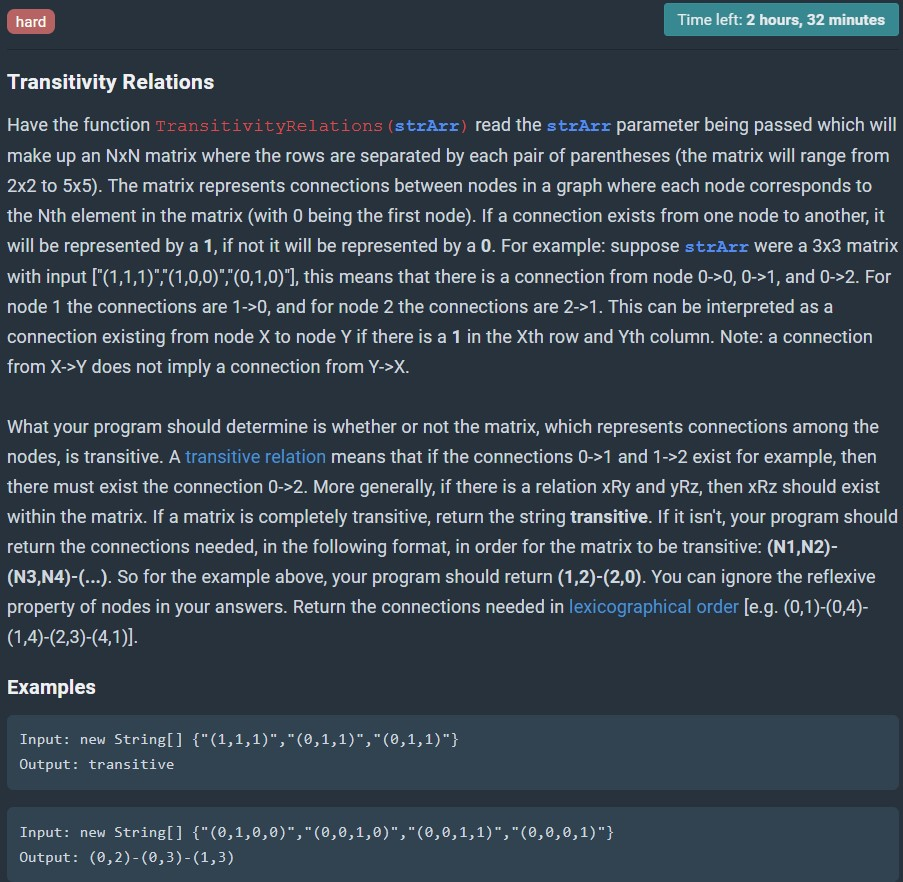

# Transitivity Relations

Have the function TransitivityRelations(strArr) read the strArr parameter being passed which will make up an NxN matrix where the rows are separated by each pair of parentheses (the matrix will range from 2x2 to 5x5). The matrix represents connections between nodes in a graph where each node corresponds to the Nth element in the matrix (with 0 being the first node). If a connection exists from one node to another, it will be represented by a 1, if not it will be represented by a 0. For example: suppose strArr were a 3x3 matrix with input ["(1,1,1)","(1,0,0)","(0,1,0)"], this means that there is a connection from node 0->0, 0->1, and 0->2. For node 1 the connections are 1->0, and for node 2 the connections are 2->1. This can be interpreted as a connection existing from node X to node Y if there is a 1 in the Xth row and Yth column. Note: a connection from X->Y does not imply a connection from Y->X.

What your program should determine is whether or not the matrix, which represents connections among the nodes, is transitive. A transitive relation means that if the connections 0->1 and 1->2 exist for example, then there must exist the connection 0->2. More generally, if there is a relation xRy and yRz, then xRz should exist within the matrix. If a matrix is completely transitive, return the string transitive. If it isn't, your program should return the connections needed, in the following format, in order for the matrix to be transitive: (N1,N2)-(N3,N4)-(...). So for the example above, your program should return (1,2)-(2,0). You can ignore the reflexive property of nodes in your answers. Return the connections needed in lexicographical order [e.g. (0,1)-(0,4)-(1,4)-(2,3)-(4,1)].  
Examples  
Input: new String[] {"(1,1,1)","(0,1,1)","(0,1,1)"}  
Output: transitive  
Input: new String[] {"(0,1,0,0)","(0,0,1,0)","(0,0,1,1)","(0,0,0,1)"}  
Output: (0,2)-(0,3)-(1,3)



## Testing

Run

```sh
$ node test.js
```

to show whether the test cases are true or false. You can add new test cases into the "testCases" constant within the format of [testCase, expectedOutput].
