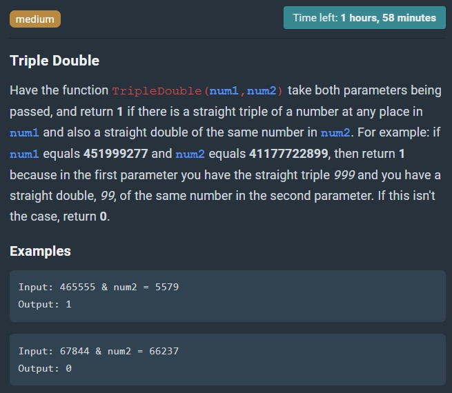

# Triple Double

Have the function TripleDouble(num1,num2) take both parameters being passed, and return 1 if there is a straight triple of a number at any place in num1 and also a straight double of the same number in num2. For example: if num1 equals 451999277 and num2 equals 41177722899, then return 1 because in the first parameter you have the straight triple 999 and you have a straight double, 99, of the same number in the second parameter. If this isn't the case, return 0.

Examples  
Input: 465555 & 5579  
Output: 1  
Input: 67844 & 66237  
Output: 0



## Testing

Run

```sh
$ node test.js
```

to show whether the test cases are true or false. You can add new test cases into the "testCases" constant within the format of [testCase, expectedOutput].
